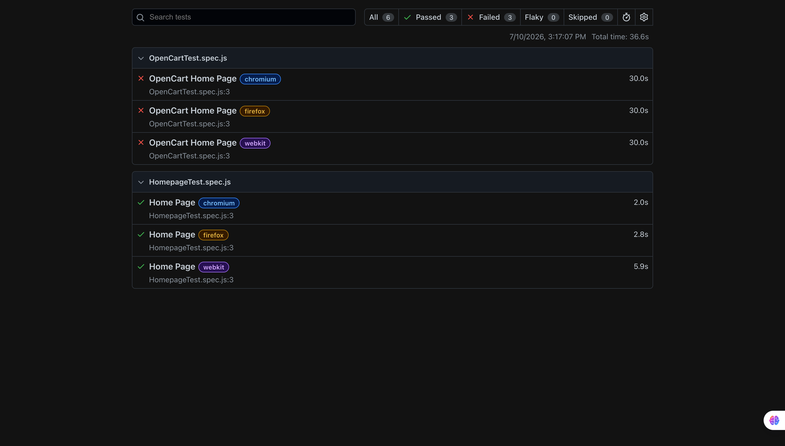

# 🚀 Playwright Automation Framework

## 📖 Overview

This project is an end-to-end UI Automation Framework developed using **Playwright with JavaScript** for testing web applications.

It includes automation scripts for OpenCart and homepage validation with Playwright best practices.

---

## 🛠 Tech Stack

- Playwright
- JavaScript
- Node.js
- Git
- GitHub

---

## ✨ Features

- UI Automation Testing
- Playwright Assertions
- Built-in Locators
- Multiple Element Handling
- OpenCart Automation
- Homepage Validation
- Cross Browser Testing

---

## 📁 Project Structure

```text
homepage-tests/
tests/
playwright.config.js
package.json
```

---

## ⚙️ Installation

```bash
npm install
```

---

## ▶️ Execute Tests

```bash
npx playwright test
```

---

## 📌 Author

**Reshma Perween**

QA Engineer | Manual & Automation Testing

📍 Dubai, UAE

📧 reshmaperween0250@gmail.com

🔗 LinkedIn:
https://www.linkedin.com/in/reshma-perween

🔗 GitHub:
https://github.com/reshmaperween-qa
---

## 📸 Playwright Test Report

Below is the Playwright HTML Report generated after executing the test suite.

